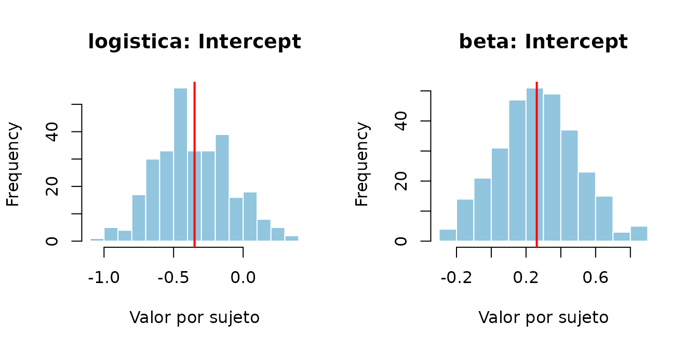
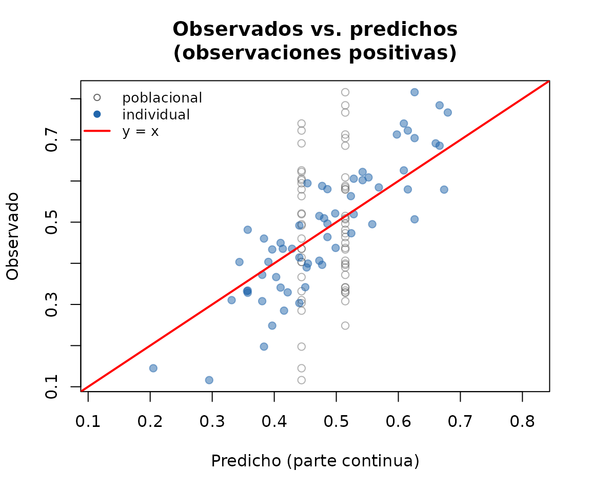
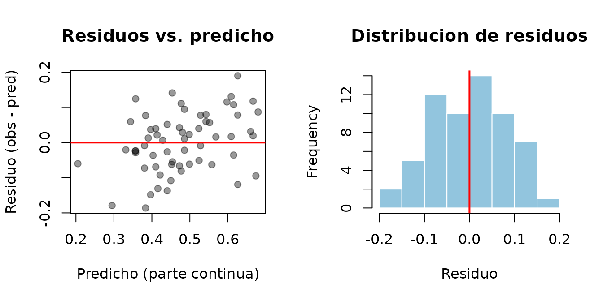

# Introduccion a saemMicrobiome

``` r

library(saemMicrobiome)
```

## Que problema resuelve este paquete

Los datos de microbioma longitudinal (varias muestras por sujeto a lo
largo del tiempo) suelen tener dos caracteristicas que los modelos
mixtos estandar no manejan bien:

1.  **Inflacion de ceros**: muchos taxones estan ausentes en una
    fraccion grande de las muestras, ademas de tener una distribucion
    continua condicional a estar presentes.
2.  **Dependencia entre observaciones del mismo sujeto**: hay que
    modelar un efecto aleatorio por sujeto, no solo efectos fijos.

`saemMicrobiome` ofrece dos modelos para este problema, ambos estimados
con el algoritmo Stochastic Approximation EM (SAEM) desarrollado por
John Barrera:

- **ZIBR**
  ([`fit_zibr()`](https://gabrielagutierrezbernal.github.io/SaemMicrobioma_01/reference/fit_zibr.md)):
  para cuando la respuesta es una **proporcion** (por ejemplo,
  abundancia relativa de un taxon respecto al total de la muestra), en
  el intervalo `[0, 1)`.
- **ZIBBMR**
  ([`fit_zibbmr()`](https://gabrielagutierrezbernal.github.io/SaemMicrobioma_01/reference/fit_zibbmr.md)):
  para cuando la respuesta es un **conteo** (numero de lecturas del
  taxon) junto con el total de lecturas de la muestra (profundidad de
  secuenciacion). Es preferible a ZIBR cuando la profundidad de
  secuenciacion varia mucho entre muestras, porque modela esa variacion
  explicitamente en vez de solo trabajar con la proporcion ya
  normalizada.

## Simular datos y ajustar un modelo ZIBR

``` r

# Solo hace falta cambiar n_subjects / n_time; n_obs se deriva de ellos.
n_subjects <- 30
n_time <- 4
n_obs <- n_subjects * n_time

set.seed(1)
dat <- simulate_zibr_data(
  n_subjects = n_subjects, n_time = n_time,
  X = matrix(rbinom(n_obs, 1, 0.5)), Z = matrix(rbinom(n_obs, 1, 0.5)),
  alpha = c(-0.3, 0.5), beta = c(0.2, -0.4),
  sigma_alpha = 0.4, sigma_beta = 0.3, phi = 15, seed = 1
)

head(dat)
#>     Subject Time         Y X.1 Z.1
#> 1 Subject.1    1 0.0000000   0   1
#> 2 Subject.1    2 0.0000000   0   0
#> 3 Subject.1    3 0.0000000   1   0
#> 4 Subject.1    4 0.3419259   1   0
#> 5 Subject.2    1 0.0000000   0   1
#> 6 Subject.2    2 0.5880479   1   0

fit <- fit_zibr(
  y = dat$Y, id = dat$Subject, X = dat$X.1, Z = dat$Z.1,
  phi_start = 10, alpha_start = c(-0.2, 0.1), beta_start = c(0.1, 0.1),
  n_iter = 100, seed = 1, compute_fim = TRUE
)

fit
#> ===== Resultados SAEM-ZIBR =====
#> == Parte logistica: p_it ==
#>              Estimate   Type
#> Intercept 0.009898927 Random
#> X.1       0.101047754  Fixed
#> == Parte beta: u_it ==
#>              Estimate   Type
#> Intercept  0.05792314 Random
#> Z.1       -0.28304003  Fixed
#> === Varianzas de efectos aleatorios ===
#> == Parte logistica ==
#>             Variance  sqrt.Var
#> Intercept 0.09888517 0.3144601
#> == Parte beta ==
#>            Variance  sqrt.Var
#> Intercept 0.2673807 0.5170887
#> === Phi: 22.66785
#> === Log-verosimilitud marginal (importance sampling): -48.69255
```

El objeto devuelto tiene metodos estandar de R para modelos ajustados:

``` r

coef(fit)
#> [1]  0.009898927  0.101047754  0.057923135 -0.283040031
logLik(fit)
#> 'log Lik.' -48.69255 (df=7)
se(fit)
#> [1] 0.2058814 0.3469675 0.1631279 0.2155122 6.0893936 0.1129842 0.1250804
```

El metodo [`plot()`](https://rdrr.io/r/graphics/plot.default.html)
ofrece varios graficos segun el argumento `which`: convergencia del
algoritmo, coeficientes con intervalo de confianza, y distribucion de
los efectos aleatorios.

``` r

plot(fit, which = "convergencia")   # traza del algoritmo (por defecto)
```


``` r

plot(fit, which = "coeficientes")   # coeficientes con IC 95%
```


``` r

plot(fit, which = "aleatorios")     # efectos aleatorios por sujeto
```



Tambien hay graficos de diagnostico del ajuste: observados vs. predichos
y residuos (de la parte continua, en las observaciones donde el taxon
esta presente).

``` r

plot(fit, which = "ajuste")         # observados vs. predichos
```



``` r

plot(fit, which = "residuos")       # residuos
```



## El mismo flujo para ZIBBMR (conteos)

Cuando se tiene el conteo de lecturas y el total de lecturas por
muestra,
[`fit_zibbmr()`](https://gabrielagutierrezbernal.github.io/SaemMicrobioma_01/reference/fit_zibbmr.md)
modela directamente esa informacion con una verosimilitud beta-binomial,
en vez de trabajar con la proporcion ya dividida:

``` r

# Reutiliza n_subjects / n_time / n_obs del ejemplo anterior.
S <- rep(1000, n_obs)
dat_counts <- simulate_zibbmr_data(
  n_subjects = n_subjects, n_time = n_time, S = S,
  X = matrix(rbinom(n_obs, 1, 0.5)), Z = matrix(rbinom(n_obs, 1, 0.5)),
  alpha = c(-0.3, 0.5), beta = c(0.2, -0.4),
  sigma_alpha = 0.4, sigma_beta = 0.3, phi = 15, seed = 1
)

fit_counts <- fit_zibbmr(
  y = dat_counts$Y, S = dat_counts$TotalCounts, id = dat_counts$Subject,
  X = dat_counts$X.1, Z = dat_counts$Z.1,
  phi_start = 10, alpha_start = c(-0.2, 0.1), beta_start = c(0.1, 0.1),
  n_iter = 100, seed = 1, compute_fim = FALSE
)

fit_counts
#> ===== Resultados SAEM-ZIBBMR =====
#> == Parte logistica: p_it ==
#>             Estimate   Type
#> Intercept 0.01232391 Random
#> X.1       0.16159293  Fixed
#> == Parte beta-binomial: u_it ==
#>             Estimate   Type
#> Intercept  0.1988194 Random
#> Z.1       -0.5146478  Fixed
#> === Varianzas de efectos aleatorios ===
#> == Parte logistica ==
#>             Variance  sqrt.Var
#> Intercept 0.01775188 0.1332362
#> == Parte beta-binomial ==
#>             Variance  sqrt.Var
#> Intercept 0.06562225 0.2561684
#> === Phi: 24.4826
#> === Log-verosimilitud marginal (importance sampling): -464.5139
```

## Ajustar varios taxones de un data frame

En la practica los datos vienen como un data frame ancho (una columna
por taxon).
[`fit_zibr_taxon()`](https://gabrielagutierrezbernal.github.io/SaemMicrobioma_01/reference/fit_zibr_taxon.md)/[`fit_zibbmr_taxon()`](https://gabrielagutierrezbernal.github.io/SaemMicrobioma_01/reference/fit_zibbmr_taxon.md)
evitan tener que armar a mano las matrices `X`/`Z` para cada taxon, y
[`fit_zibr_taxa()`](https://gabrielagutierrezbernal.github.io/SaemMicrobioma_01/reference/fit_zibr_taxa.md)/
[`fit_zibbmr_taxa()`](https://gabrielagutierrezbernal.github.io/SaemMicrobioma_01/reference/fit_zibbmr_taxa.md)
permiten ajustar varios taxones de una vez:

``` r

sim <- simular_datos_microbioma(n_ind = 15, n_time = 4, n_taxa = 3, seed = 1)
head(sim$proporcion)
#>   id tiempo grupo    N Taxon1 Taxon2 Taxon3
#> 1  1      1     0 1000  0.057  0.495  0.448
#> 2  1      2     0 1000  0.207  0.581  0.212
#> 3  1      3     0 1000  0.143  0.654  0.203
#> 4  1      4     0 1000  0.177  0.558  0.265
#> 5  2      1     1 1000  0.533  0.188  0.279
#> 6  2      2     1 1000  0.138  0.214  0.648

fits <- fit_zibr_taxa(
  data = sim$proporcion, taxa = sim$taxa, id = "id",
  covariates = c("tiempo", "grupo"), n_iter = 50, seed = 1
)

sapply(fits, coef)
#>           Taxon1      Taxon2     Taxon3
#> [1,]  0.05587996  0.13111349 -0.0423997
#> [2,] 20.24932804 19.57832672 21.0280064
#> [3,]  3.06101238  3.01938273  3.1301032
#> [4,] -0.63237382 -0.39258341 -0.3906250
#> [5,]  0.01704677 -0.08132268 -0.1669231
#> [6,]  0.03324854 -0.18405358  0.0821391
```

## Comparar modelos anidados con una prueba de razon de verosimilitudes

Para decidir si una covariable aporta significativamente, se compara un
modelo completo contra uno reducido (sin esa covariable) con
[`lrt_zibr()`](https://gabrielagutierrezbernal.github.io/SaemMicrobioma_01/reference/lrt_zibr.md)/
[`lrt_zibbmr()`](https://gabrielagutierrezbernal.github.io/SaemMicrobioma_01/reference/lrt_zibbmr.md):

``` r

full <- fit_zibr_taxon(
  data = sim$proporcion, taxon = "Taxon1", id = "id",
  covariates = c("tiempo", "grupo"), n_iter = 50, seed = 1
)
reduced <- fit_zibr_taxon(
  data = sim$proporcion, taxon = "Taxon1", id = "id",
  covariates = "tiempo", n_iter = 50, seed = 1
)

lrt_zibr(full, reduced, df = 1)
#>    LL_full LL_reduced      LRT df    p_value
#> 1 14.64046   12.90933 3.462263  1 0.06278431
```

Para muchos taxones a la vez,
[`lrt_zibr_table()`](https://gabrielagutierrezbernal.github.io/SaemMicrobioma_01/reference/lrt_zibr_table.md)/[`lrt_zibbmr_table()`](https://gabrielagutierrezbernal.github.io/SaemMicrobioma_01/reference/lrt_zibbmr_table.md)
arman una tabla con una fila por taxon.

## La funcion “madre”: fit_saem_microbiome()

Si se prefiere no elegir entre
[`fit_zibr()`](https://gabrielagutierrezbernal.github.io/SaemMicrobioma_01/reference/fit_zibr.md)/[`fit_zibbmr()`](https://gabrielagutierrezbernal.github.io/SaemMicrobioma_01/reference/fit_zibbmr.md)
explicitamente,
[`fit_saem_microbiome()`](https://gabrielagutierrezbernal.github.io/SaemMicrobioma_01/reference/ajustar_modelo_microbioma.md)
(alias de
[`ajustar_modelo_microbioma()`](https://gabrielagutierrezbernal.github.io/SaemMicrobioma_01/reference/ajustar_modelo_microbioma.md))
despacha al modelo correcto segun el argumento `modelo`, tomando la
respuesta, el total de lecturas (si aplica) y las covariables
directamente de un data frame por nombre de columna:

``` r

fit_saem_microbiome(
  modelo = "zibr", datos = sim$proporcion, taxon = "Taxon1",
  id = "id", covariables = c("tiempo", "grupo"), iter = 50, seed = 1
)
#> ===== Resultados SAEM-ZIBR =====
#> == Parte logistica: p_it ==
#>              Estimate   Type
#> Intercept  0.05587996 Random
#> tiempo    20.24932804  Fixed
#> grupo      3.06101238  Fixed
#> == Parte beta: u_it ==
#>              Estimate   Type
#> Intercept -0.63237382 Random
#> tiempo     0.01704677  Fixed
#> grupo      0.03324854  Fixed
#> === Varianzas de efectos aleatorios ===
#> == Parte logistica ==
#>              Variance   sqrt.Var
#> Intercept 0.003020215 0.05495648
#> == Parte beta ==
#>              Variance   sqrt.Var
#> Intercept 0.004971694 0.07051024
#> === Phi: 3.987447
#> === Log-verosimilitud marginal (importance sampling): 14.64046
```

## Datos propios: preparar un dataset tipo Romero

Si los datos vienen en el formato del estudio Romero (una lista con
`SampleData` y `OTU`),
[`prepare_romero_zibr()`](https://gabrielagutierrezbernal.github.io/SaemMicrobioma_01/reference/prepare_romero_zibr.md)/[`prepare_romero_zibbmr()`](https://gabrielagutierrezbernal.github.io/SaemMicrobioma_01/reference/prepare_romero_zibbmr.md)
arman las covariables estandar (tiempo de gestacion escalado, edad
escalada, interaccion tiempo-embarazo) y filtran taxones por proporcion
de ceros, dejando todo listo para
[`fit_zibr_taxon()`](https://gabrielagutierrezbernal.github.io/SaemMicrobioma_01/reference/fit_zibr_taxon.md)/[`fit_zibbmr_taxon()`](https://gabrielagutierrezbernal.github.io/SaemMicrobioma_01/reference/fit_zibbmr_taxon.md).
Ver
[`?prepare_romero_zibr`](https://gabrielagutierrezbernal.github.io/SaemMicrobioma_01/reference/prepare_romero_zibr.md)
para el formato esperado de `SampleData`/`OTU`.
