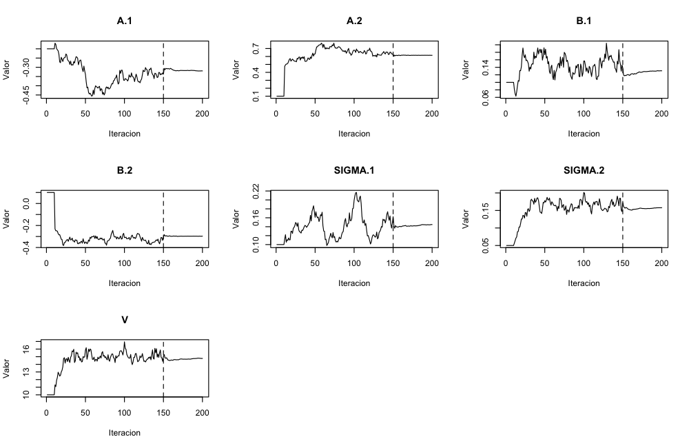
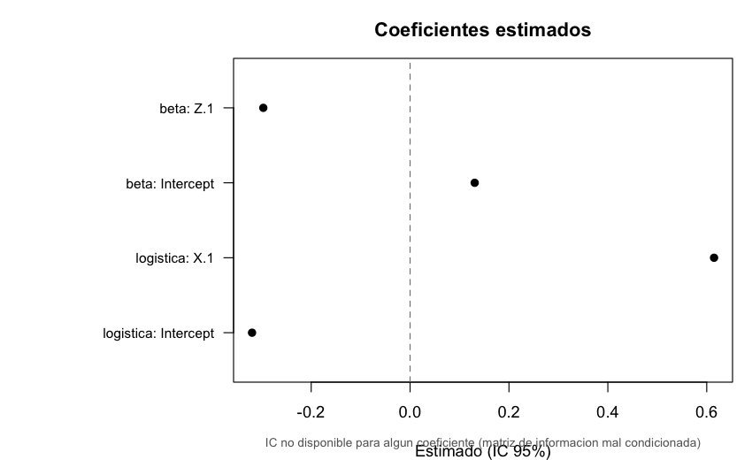
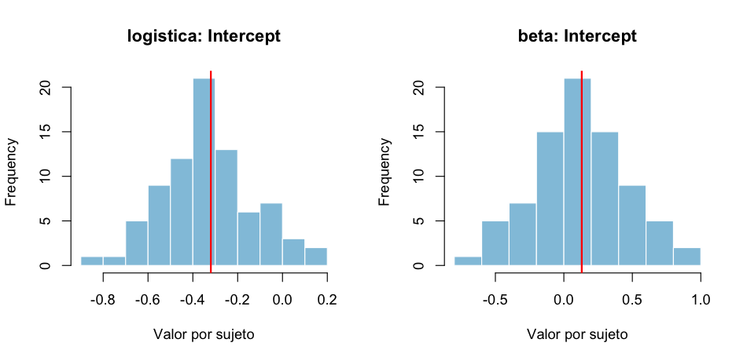
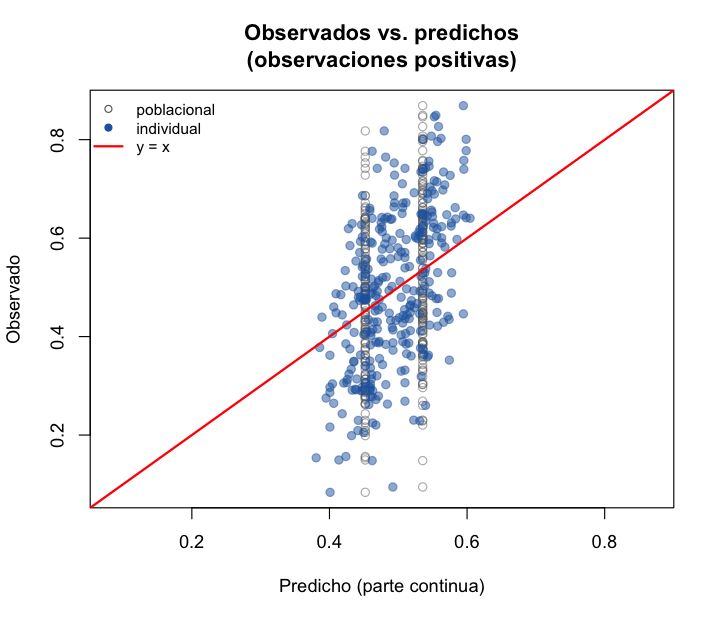
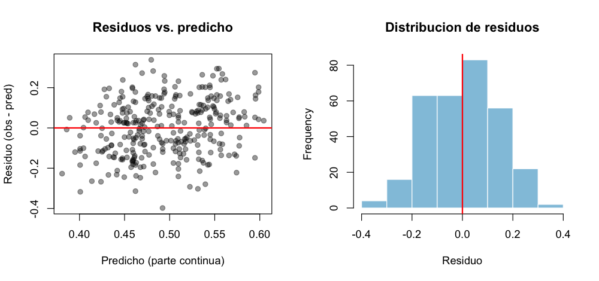

# Graficos del paquete: ideas (inspiradas en saemix) y estado

Documento de referencia sobre los graficos del paquete `saemMicrobiome`.
Toma como inspiracion `saemix` (un paquete de R que estima modelos no lineales
de efectos mixtos con el algoritmo SAEM y ofrece muchos graficos de
diagnostico), y ordena: (1) que graficos ofrece saemix, (2) cuales podemos
recuperar de nuestros ajustes, y (3) como los genera el usuario.

## 1. Graficos que ofrece saemix (referencia / ideas)

En saemix se piden con `plot(ajuste, plot.type = "...")`. Los principales:

- **Convergencia**: los parametros estimados a lo largo de las iteraciones del
  algoritmo, para revisar si convergio.
- **Verosimilitud**: la log-verosimilitud a lo largo de la estimacion.
- **Datos**: las observaciones por sujeto a lo largo del tiempo (spaghetti).
- **Observados vs. predichos**: valores observados contra los que predice el
  modelo (a nivel poblacional e individual).
- **Ajustes individuales**: la curva predicha por sujeto, sobre sus datos.
- **Residuos**: dispersion de residuos y su distribucion (histograma / QQ).
- **Efectos aleatorios**: distribucion de los efectos aleatorios estimados por
  sujeto; correlaciones entre ellos; comparacion con la distribucion teorica.
- **VPC / npde**: chequeos predictivos visuales.

## 2. Que podemos recuperar de nuestros codigos

Cada ajuste (`fit_zibr()` / `fit_zibbmr()`) guarda: la traza de los parametros
por iteracion (`trace`), los coeficientes estimados (`mu`) y su matriz de
informacion (`fisher_stoch`, si se ajusto con `compute_fim = TRUE`), los
efectos aleatorios estimados por sujeto (`psi_mean`) y los datos originales
(respuesta y covariables, en `data`). Con eso se pueden generar cinco graficos:

| Grafico | Basado en saemix | Disponible | Datos que usa |
|---------|------------------|------------|---------------|
| Convergencia            | "convergence"                 | Si | `trace` |
| Coeficientes con IC 95% | (resumen de efectos)          | Si | `mu`, `fisher_stoch` |
| Efectos aleatorios      | "random.effects"              | Si | `psi_mean` |
| Observados vs. predichos| "observations.vs.predictions" | Si | `psi_mean`, `mu`, `data` |
| Residuos                | "residuals.scatter/distribution" | Si | `psi_mean`, `data` |

Nota sobre observados vs. predichos y residuos en modelos con inflacion de
ceros: se enfocan en la **parte continua** (la magnitud dado que el taxon esta
presente), usando solo las observaciones positivas. Es lo interpretable, porque
la prediccion marginal `E[Y] = p * u` mezcla la masa de probabilidad en cero con
la parte continua y no se lee como un diagrama observado-vs-predicho clasico.

Otros graficos de saemix (ajustes individuales por sujeto a lo largo del tiempo,
VPC/npde) quedan como posible extension futura.

## 3. Como los genera el usuario

Todos salen del mismo objeto ajustado, cambiando el argumento `which`:

```r
fit <- fit_zibr(...)                # o fit_zibbmr(...), con compute_fim = TRUE
plot(fit, which = "convergencia")   # convergencia del algoritmo (por defecto)
plot(fit, which = "coeficientes")   # coeficientes con intervalo de confianza
plot(fit, which = "aleatorios")     # distribucion de los efectos aleatorios
plot(fit, which = "ajuste")         # observados vs. predichos (parte continua)
plot(fit, which = "residuos")       # residuos de la parte continua
```

Para guardarlos como imagen:

```r
png("mi_grafico.png", width = 900, height = 550)
plot(fit, which = "coeficientes")
dev.off()
```

### Ejemplos

Convergencia del algoritmo (cada panel es un parametro; la linea punteada marca
el fin del periodo de calentamiento):



Coeficientes estimados con intervalo de confianza al 95% (la linea punteada en 0
ayuda a ver si un efecto es distinto de cero):



Distribucion entre sujetos de los efectos aleatorios (uno por sujeto); la linea
roja marca la media poblacional:



Observados vs. predichos de la parte continua (observaciones positivas); la
recta roja `y = x` marca el ajuste perfecto:



Residuos de la parte continua: dispersion contra el valor predicho y su
distribucion (la referencia roja marca el 0):


